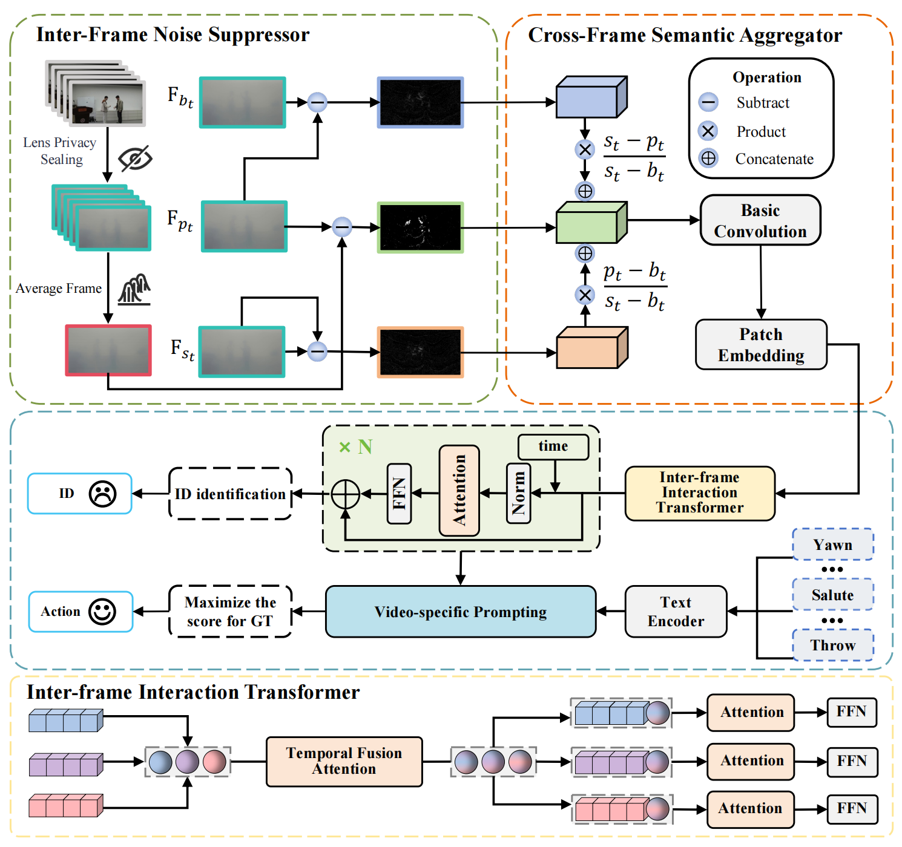

# Benchmarking Physical Privacy-Preserving Action Recognition: Device, Dataset, and Method

## Introduction

The widespread RGB sensor-based surveillance system has brought significant benefits to public safety, smart home, and intelligent healthcare. However, it has also raised privacy protection as a critical concern, particularly in the field of human action recognition. Existing privacy-preserving methods typically rely on post-capture algorithms, which often fail to fully mitigate privacy risks during data capture, leaving devices vulnerable to unauthorized access or tampering. To address this concern, we propose a physical solution and benchmark a physical privacy-preserving action recognition task utilizing a new device, dataset, and method. First, we introduce Lens Privacy Sealing (LPS), which employs a widely accessible and inexpensive laminating film as an additional device to mask the camera lens. LPS effectively mitigates privacy risks during data capture with minimal hardware modifications. Second, we collect a P$^3$AR dataset for Physical Privacy-Preserving Action Recognition, which introduces the unique challenge of video degradation induced by LPS. Third, to overcome the above challenge, we propose a single-stage Motion Semantic Prompting Network (MSPNet). Conventional human action recognition methods typically follow a two-stage process, where human detection in encrypted videos becomes difficult due to degraded visual information. To balance privacy and performance, MSPNet leverages a single-stage framework incorporating a language-image pre-training model and transformers for spatio-temporal integration, tailored for privacy-preserving action recognition that alters light input and image distribution. Furthermore, we develop modules to minimize interference from privacy masks, ensuring effective motion capture while preserving privacy. Extensive experiments on the proposed dataset demonstrate that MSPNet achieves effective privacy protection while maintaining competitive recognition accuracy.



## Installation

To set up the environment, follow the steps below:

```bash
conda create -n MSPNet python=3.7
conda activate MSPNet
pip install -r requirements.txt
```

To install Apex, use the following commands:

```bash
git clone https://github.com/NVIDIA/apex
cd apex
pip install -v --disable-pip-version-check --no-cache-dir --global-option="--cpp_ext" --global-option="--cuda_ext" ./
```

We provide the complete environment configuration in `requirements.yml` for your reference.

---

## Datasets

Please refer to our [repository](https://github.com/adventurer-w/P3AR-NTU) for instructions on downloading and preprocessing the P$^3$AR-NTU dataset.

---

## Training

To train the MSPNet model on the P$^3$AR-NTU dataset using 4 GPUs, execute the following command:

```bash
python -m torch.distributed.launch --nproc_per_node=4 --master_port=25658 ntu_main.py \
    --config configs/NTU/NTU120_XSet.yaml \
    --distributed True \
    --accumulation-steps 2 \
    --output output/ntu_encrypted
```

### Notes:

- If your system has limited GPU memory or fewer GPUs, you can adjust the `--accumulation-steps` parameter to maintain the overall batch size.
- Configuration files are located in the `configs` directory. Ensure that the correct dataset path is specified in the configuration.

### Pretrained CLIP Model:

The pretrained CLIP model will be automatically downloaded. Alternatively, you can manually specify the path using the following option:

```bash
--pretrained /PATH/TO/PRETRAINED
```

---

## Testing

To test the MSPNet model on the P$^3$AR-NTU dataset using 4 GPUs, execute the following command:

```bash
python -m torch.distributed.launch --nproc_per_node=4 --master_port=25658 ntu_main.py \
    --config configs/NTU/NTU120_XSet.yaml \
    --resume /PATH/TO/CKPT \
    --output output/ntu_encrypted \
    --only_test True
```
